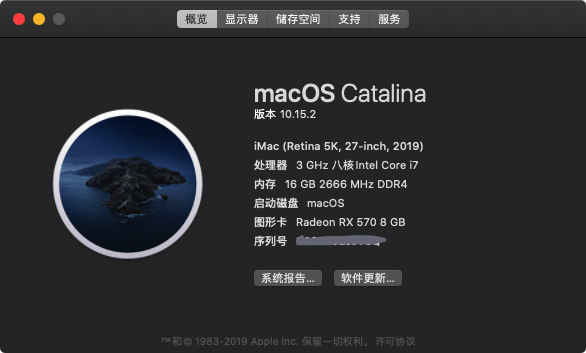
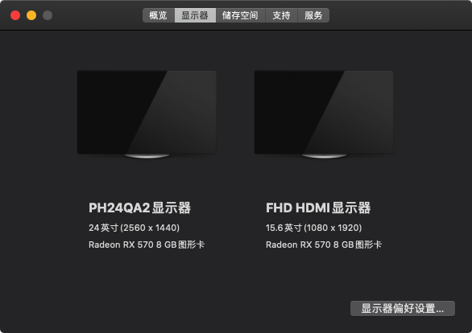
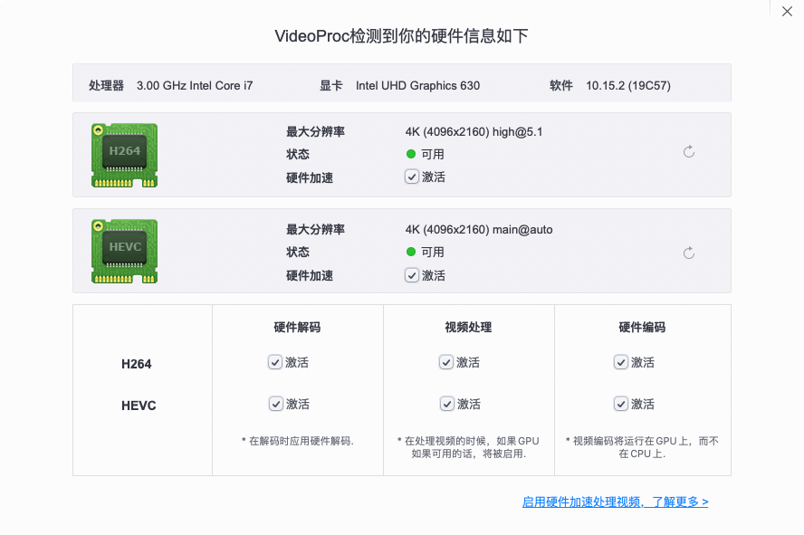

# Asus-Prime-Z390m-plus-efi

#### 版本说明

系统版本：macOS Catalina 10.15.5

SMBIOS: iMac 19,1

OpenCore Version : 0.5.8

#### 具体配置如下：

| 硬件| 型号    |
|----|----------|
| 主板  | Asus Prime Z390m-plus |
| CPU  | Intel i9-9900K   |
| 显卡  | 藍寶石 RX580 2048SP PLUS 8G (刷bios为 蓝宝石 RX570 8G)  |
| 内存  | 海盜船 DDR4 3200 16G * 2   |
| 固态  | Intel SSD S4510 1.92T & Sandisk 256G M.2   |
| 网卡  | BCM943602CS  & Intel 82599 10G |

#### 完善程度：

* 蓝牙 + Wi-Fi + 接力（Hand Off）+ 随航 正常

* 所有USB接口 正常

* USB 5G 传输 正常 

* 显卡硬解  正常

* 睡眠重启 正常

